# LLM Design Patterns & RAG Evaluation Framework

## Description

This project provides a comprehensive framework for building and evaluating sophisticated LLM-based systems using proven design patterns. It combines:

1. **Advanced Design Patterns**: Judge/Jury evaluation, Tool Use, Plan-and-Execute, Reflection/Self-Correction, and Multi-Agent Collaboration patterns
2. **RAG Evaluation**: Robust evaluation framework for Retrieval-Augmented Generation (RAG) pipelines using the `ragas` library
3. **Multi-Agent Systems**: Orchestration of specialized LLM agents for complex software engineering tasks
4. **High Test Coverage**: 96% code coverage with 176 comprehensive tests (100% passing)

The framework demonstrates **six powerful LLM design patterns** that can be composed together for building production-ready AI systems. Each pattern addresses different challenges: evaluation (Judge/Jury), capability extension (Tool Use), task decomposition (Plan-and-Execute), quality improvement (Reflection/Self-Correction), and team collaboration (Multi-Agent).

## Installation

Follow these steps to set up the project environment on Windows.

1. **Initialize Git:**
   Run the `000_init.bat` script to initialize the Git repository and configure user settings.

   ```bash
   .\000_init.bat
   ```

2. **Create Virtual Environment:**
   Run `001_env.bat` to create a Python virtual environment named `.venv`.

   ```bash
   .\001_env.bat
   ```

3. **Activate Virtual Environment:**
   Activate the environment by running `002_activate.bat`.

   ```bash
   .\002_activate.bat
   ```

4. **Install Dependencies:**
   Run `003_setup.bat` to install all the required packages from `requirements.txt`.

   ```bash
   .\003_setup.bat
   ```

## Usage

The `004_run.bat` script is the unified entry point for all evaluation tasks. It accepts a command as its first argument to determine which evaluation to run.

### Running Evaluations

1.  **Display Help:**
    Run the script without any arguments to see a detailed list of all available commands and their specific options.

    ```bash
    .\004_run.bat
    ```

2.  **Classic Metric Commands**
    These commands run the original evaluation script (`individual_metrics_runner.py`) for classic NLP and Ragas metrics.

    *   **Usage:** `.\004_run.bat <metric_name>`
    *   **Example:** To run the `faithfulness` metric:
        ```bash
        .\004_run.bat faithfulness
        ```
    *   **Available Commands:** `faithfulness`, `answer_relevancy`, `context_recall`, `context_precision`, `answer_correctness`, `classic`, `retrieval`, `all`.

3.  **Agentic Command: `judge`**
    This command runs an evaluation on a dataset using a single, specialized judge agent.

    *   **Usage:** `.\004_run.bat judge --input <infile> --output <outfile> --judge <judge_name>`
    *   **Example:** To evaluate a dataset for clarity:
        ```bash
        .\004_run.bat judge --input data/eval_data.csv --output results/judge_clarity_results.csv --judge clarity
        ```
    *   **Available Judges:** `factual`, `clarity`, `relevance`, `safety`.

4.  **Agentic Command: `jury`**
    This command runs the full, multi-agent system for a comprehensive evaluation.

    *   **Usage:** `.\004_run.bat jury --input <infile> --output <outfile>`
    *   **Example:**
        ```bash
        .\004_run.bat jury --input data/eval_data.csv --output results/jury_final_verdict.csv
        ```

5.  **Execution Pattern: `tool-use`**
    This command demonstrates the Tool Use pattern by running an agent that can use external tools to answer a prompt.

    *   **Usage:** `.\004_run.bat tool-use "<prompt>"`
    *   **Example:** To ask a question that requires a web search:
        ```bash
        .\004_run.bat tool-use "what is ragas?"
        ```

6.  **Execution Pattern: `plan-and-execute`**
    This command demonstrates the Planning pattern by running an agent that creates and executes a multi-step plan to achieve a goal.

    *   **Usage:** `.\004_run.bat plan-and-execute "<goal>"`
    *   **Example:** To ask a multi-step question:
        ```bash
        .\004_run.bat plan-and-execute "what is the square root of 256?"
        ```

7.  **Execution Pattern: `reflection`**
    This command demonstrates the Reflection/Self-Correction pattern by running an agent that iteratively improves its output through self-critique.

    *   **Usage:** `.\004_run.bat reflection "<task>" [--max-iterations N] [--quality-threshold 0.0-1.0]`
    *   **Example:** To generate high-quality content:
        ```bash
        .\004_run.bat reflection "Write a Python function to calculate factorial"
        ```
    *   **Options:**
        - `--max-iterations N`: Maximum refinement cycles (default: 3)
        - `--quality-threshold X`: Quality score threshold 0.0-1.0 (default: 0.8)

8.  **Execution Pattern: `collaborate`**
    This command demonstrates the Multi-Agent Collaboration pattern by running a team of specialized AI agents working together.

    *   **Usage:** `.\004_run.bat collaborate [mode]`
    *   **Modes:**
        - `sequential`: Agents work in pipeline (Planner → Coder → Tester → Reviewer)
        - `parallel`: All agents analyze simultaneously, then synthesize
        - `hierarchical`: Coordinator manages and delegates to specialists (default)
    *   **Examples:**
        ```bash
        .\004_run.bat collaborate sequential
        .\004_run.bat collaborate parallel
        .\004_run.bat collaborate hierarchical
        ```

---

## Design Patterns Overview

This framework implements six sophisticated LLM design patterns. For complete documentation, see [DESIGN_PATTERNS.md](DESIGN_PATTERNS.md).

### Pattern Summary

| Pattern | Purpose | Complexity | LLM Calls | Best For |
|---------|---------|------------|-----------|----------|
| **Judge** | Single-criterion evaluation | Low | 1-2 | Focused quality assessment |
| **Jury** | Multi-dimensional evaluation | High | 3-6+ | Holistic quality judgment |
| **Tool Use** | Extend LLM capabilities | Medium | Varies | Real-world data & actions |
| **Plan-and-Execute** | Task decomposition | Medium | 2-N | Complex multi-step tasks |
| **Reflection** | Iterative quality improvement | Medium | 3-5x | High-quality content generation |
| **Multi-Agent Collaboration** | Specialized agent teamwork | High | 4-N | Complex software engineering tasks |

### Pattern 1: LLM as a Judge

Single specialized LLM agent evaluates one specific quality dimension (factual accuracy, clarity, relevance, or safety).

**Implementation**: `src/agents/factual_judge.py`, `clarity_judge.py`, `relevance_judge.py`, `safety_judge.py`

**Use Cases**:
- Targeted evaluation of specific quality dimensions
- Quick assessment with detailed written verdicts
- Building blocks for more complex evaluation systems

**Use Cases**:
- Targeted evaluation of specific quality dimensions
- Quick assessment with detailed written verdicts
- Building blocks for more complex evaluation systems

#### Judge Pattern Architecture

The Judge pattern uses a single specialized agent to evaluate content against one criterion.

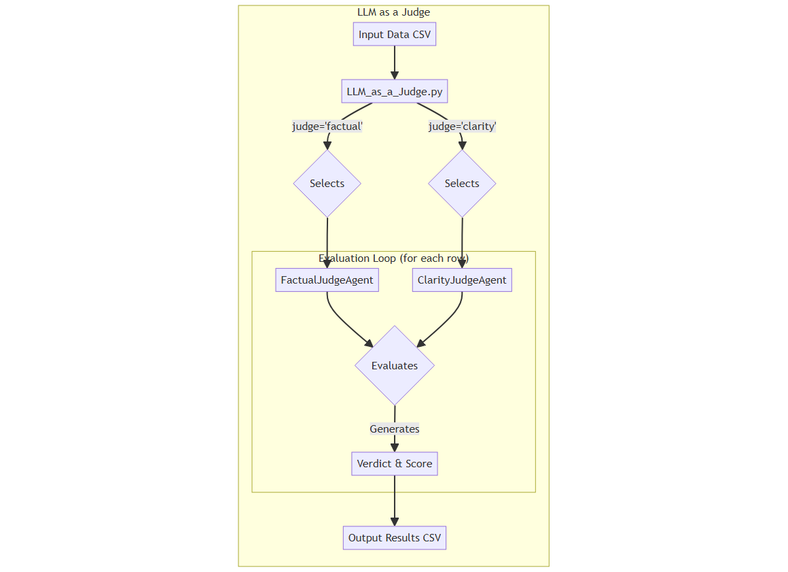

<details>
<summary>Mermaid Diagram Code</summary>

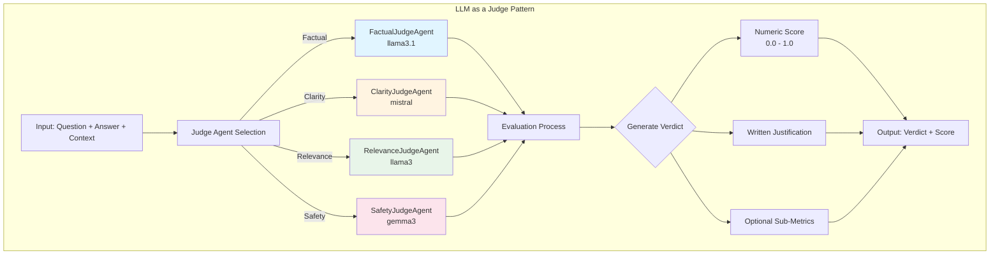

</details>

### Pattern 2: LLM as a Jury (Multi-Agent Evaluation)

The script requires an input CSV file containing the data to be evaluated. The necessary columns depend on the judge being used. For the `FactualJudgeAgent`, the following columns are required:

*   `question`: The input question.
*   `answer`: The generated answer to be evaluated.
*   `contexts`: A string representation of a list of context documents used to generate the answer.
*   `ground_truth`: The correct or ideal answer.

**Sample Input: `evaluation_data.csv`**

```csv
question,answer,contexts,ground_truth
"What is the capital of France?","The capital of France is Paris.","['Paris is the capital and most populous city of France.']","The capital of France is indeed Paris."
"What is the main function of a cell's nucleus?","The nucleus controls the cell's growth and reproduction.","['The nucleus is a membrane-bound organelle that contains the cell''s genetic material.']","The nucleus directs all of the cell's activities, including growth and reproduction."
```

#### Judge Output

The script generates an output CSV file containing the detailed verdict from the judge for each case.

*   `case_index`: The row number from the input file.
*   `judge`: The name of the judge agent that ran the evaluation.
*   `score`: The final score assigned by the judge.
*   `verdict`: The detailed written explanation from the judge.
*   **(Optional)**: Additional columns for sub-metrics, such as `faithfulness` and `answer_correctness` from the `FactualJudgeAgent`.

**Sample Output: `factual_results.csv`**

```csv
case_index,judge,score,verdict,faithfulness,answer_correctness
0,FactualJudgeAgent,0.995,"The answer is factually consistent with the context and accurate against the ground truth...",1.0,0.99
1,FactualJudgeAgent,0.58,"The answer is partially correct, but not entirely faithful to the context...",0.5,0.66
```

### Pattern 2: LLM as a Jury (Multi-Agent Evaluation)

Orchestrates a panel of specialized Judge agents, with a Chief Justice synthesizing their verdicts into a comprehensive final judgment.

**Implementation**: `src/agents/chief_justice.py` + all judge agents

**Use Cases**:
- Holistic quality assessment across multiple dimensions
- Resolving trade-offs between competing quality aspects
- Production evaluation systems requiring high confidence

#### Jury Pattern Architecture

The Jury pattern coordinates multiple specialized judges, with a Chief Justice synthesizing their verdicts.

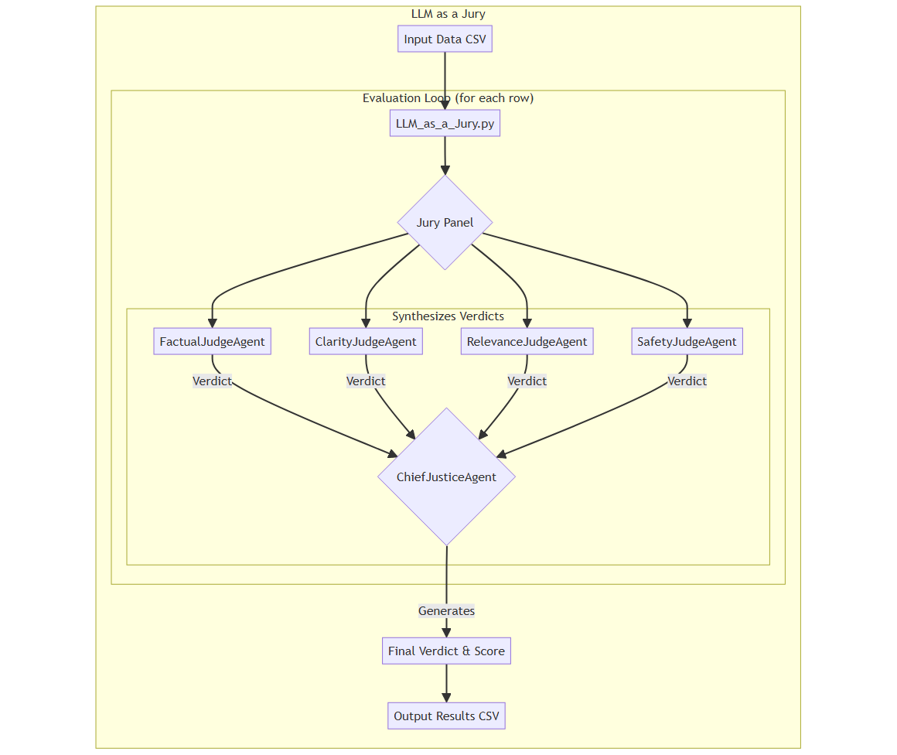

<details>
<summary>Mermaid Diagram Code</summary>

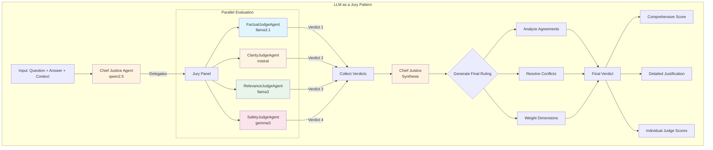

</details>

#### Input Format

The script requires an input CSV file with the following columns:

#### Input Format

The script requires an input CSV file with the following columns:

*   `question`: The input question
*   `answer`: The generated answer to be evaluated
*   `contexts`: A string representation of a list of context documents
*   `ground_truth`: The correct or ideal answer

**Sample Input: `evaluation_data.csv`**

```csv
question,answer,contexts,ground_truth
"What is the capital of France?","The capital of France is Paris.","['Paris is the capital and most populous city of France.']","The capital of France is indeed Paris."
"What is the main function of a cell's nucleus?","The nucleus controls the cell's growth and reproduction.","['The nucleus is a membrane-bound organelle that contains the cell''s genetic material.']","The nucleus directs all of the cell's activities, including growth and reproduction."
```

#### Output Format

#### Output Format

The output CSV contains the comprehensive final verdict from the Chief Justice, along with all intermediate verdicts from individual judges:

*   `case_index`: The row number from the input file
*   `final_verdict`: The comprehensive summary from the Chief Justice
*   `final_score`: The final synthesized score (0.0-1.0)
*   `[judge_name]_score`: Individual score from each judge
*   `[judge_name]_verdict`: Written verdict from each judge

**Sample Output: `jury_final_verdict.csv`**

```csv
case_index,final_verdict,final_score,factual_score,factual_verdict,clarity_score,clarity_verdict,relevance_score,relevance_verdict
0,"After a comprehensive review, the answer is deemed to be of high quality...",0.88,0.99,"The answer is factually sound.",0.85,"The answer is clear and concise.",0.9,"The answer is highly relevant."
```

---

### Pattern 3: Tool Use Pattern (Function Calling)

Equips LLM agents with external tools, enabling them to perform actions beyond text generation.

**Implementation**: `src/agents/tool_using_agent.py`, `src/tools.py`

**Available Tools**:
- **WebSearch**: DuckDuckGo web search for current information
- **Calculator**: Mathematical expression evaluation
- **DateTime**: Date/time queries and calculations
- **CodeInterpreter**: Safe Python code execution

**Use Cases**:
- Answering questions requiring real-time data
- Performing calculations and data processing
- Executing code and retrieving system information

#### Tool Use Pattern Architecture

The Tool Use pattern enables LLMs to select and execute external tools dynamically.

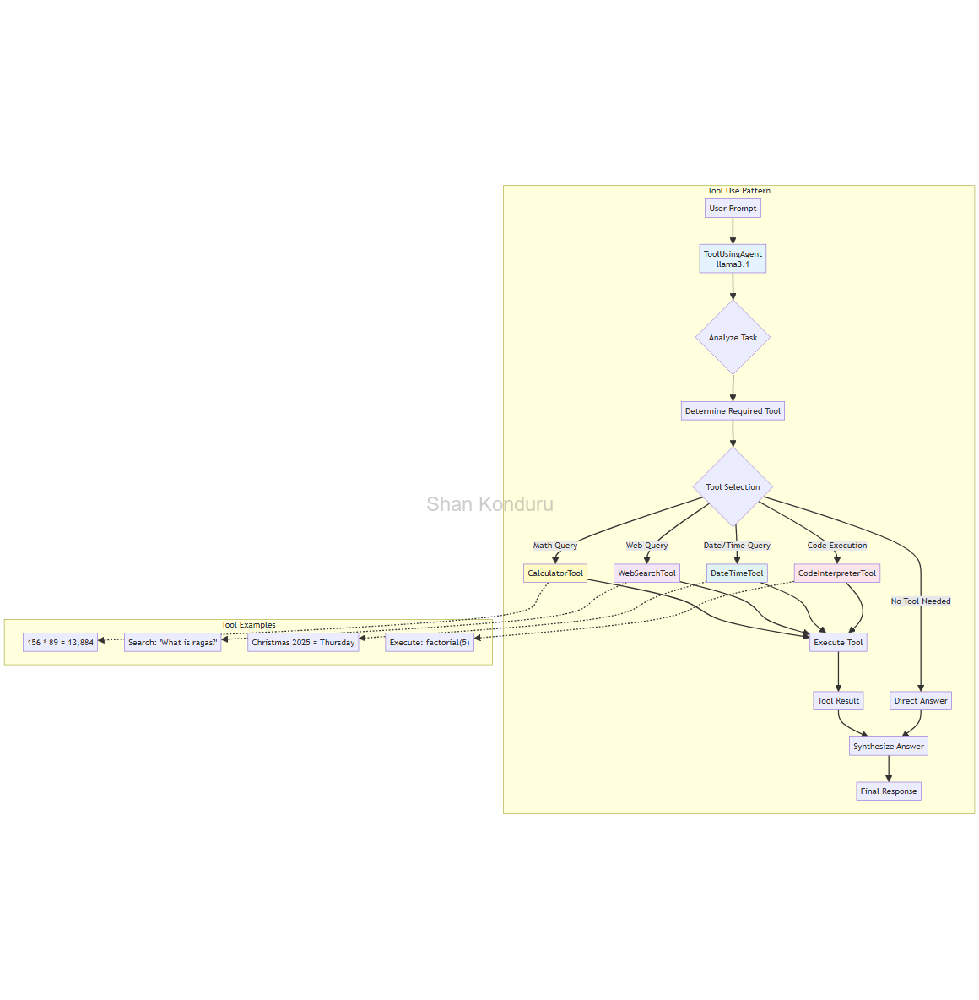

<details>
<summary>Mermaid Flowchart - Tool Use Pattern</summary>

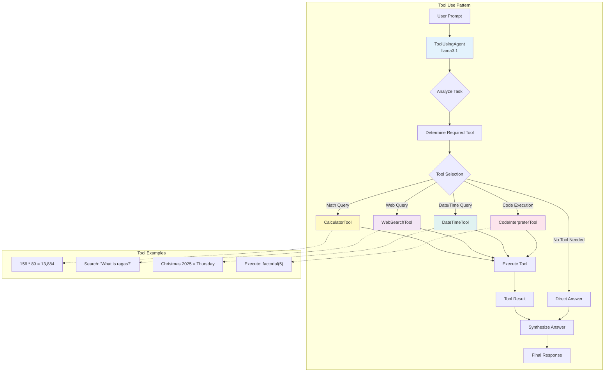

</details>

#### Tool Use Examples

**Mathematical Calculations**:
```bash
.\004_run.bat tool-use "what is 156 times 89?"
# Output: The result of 156 times 89 is 13,884.
```

**Date/Time Queries**:
```bash
.\004_run.bat tool-use "what day of the week is Christmas 2025?"
# Output: Christmas 2025 (December 25, 2025) falls on a Thursday.
```

**Web Searches**:
```bash
.\004_run.bat tool-use "what is ragas framework?"
# Output: Ragas is a framework for evaluating RAG (Retrieval-Augmented Generation) pipelines...
```

**Complex Calculations**:
```bash
.\004_run.bat tool-use "calculate the square root of 256"
# Output: The square root of 256 is 16.0.
```

---

### Pattern 4: Plan-and-Execute Pattern

Decomposes complex goals into sequential steps, each using appropriate tools.

**Implementation**: `src/agents/planning_agent.py`

**Use Cases**:
- Multi-step problem solving
- Complex queries requiring multiple tools
- Tasks with dependencies between steps

#### Plan-and-Execute Pattern Architecture

The Plan-and-Execute pattern breaks down complex tasks into a sequence of tool-using steps.

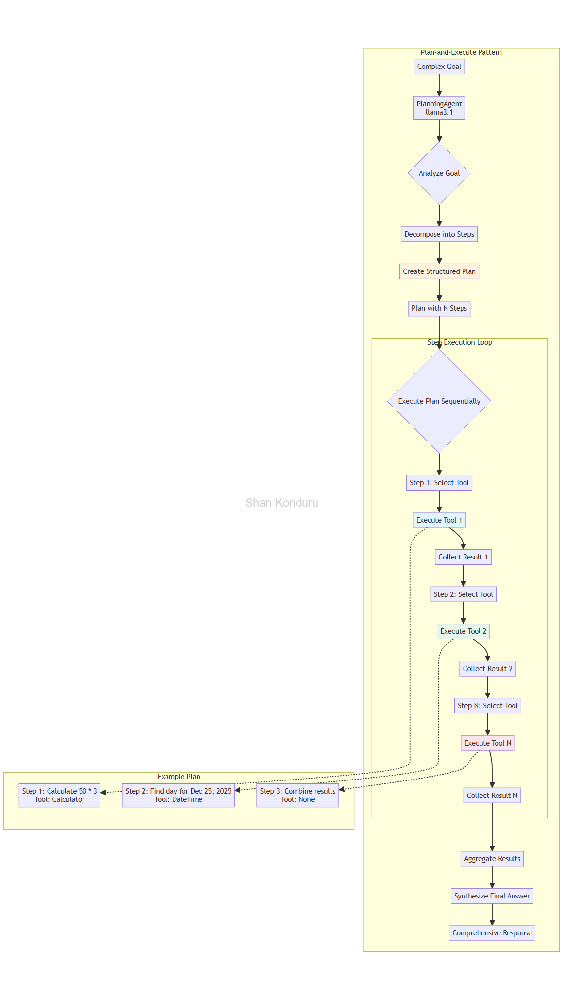

<details>
<summary>Mermaid Flowchart - Plan-and-Execute Pattern</summary>

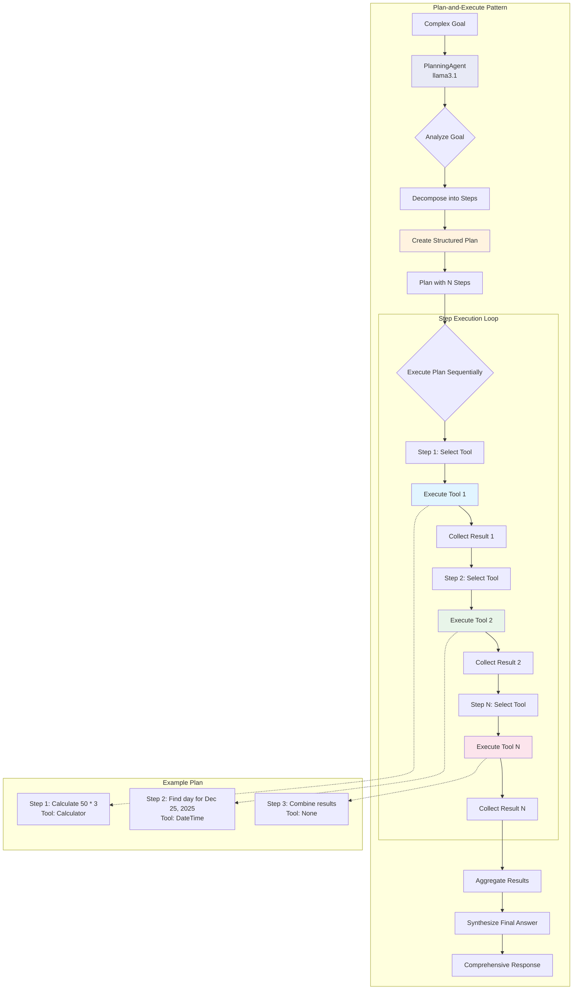

</details>

#### Plan-and-Execute Examples

**Multi-Step Calculation**:
```bash
.\004_run.bat plan-and-execute "What is 50 times 3 and what day is Christmas 2025?"
# Output:
# Step 1: Calculate 50 * 3 = 150
# Step 2: December 25, 2025 falls on Thursday
# Final: 50 times 3 equals 150, and Christmas 2025 is on Thursday.
```

**Complex Query**:
```bash
.\004_run.bat plan-and-execute "Find the square root of 144 and tell me what day of the week is December 25, 2025"
# Output:
# Step 1: sqrt(144) = 12.0
# Step 2: December 25, 2025 is Thursday
# Final: The square root of 144 is 12, and December 25, 2025 falls on Thursday.
```

---

### Pattern 5: Reflection/Self-Correction Pattern

Enables iterative quality improvement through self-critique and refinement.

**Implementation**: `src/agents/reflection_agent.py`

**Key Features**:
- Configurable iteration limits (default: 3)
- Quality threshold settings (default: 0.8)
- Comprehensive critique history
- Improvement tracking

**Use Cases**:
- High-quality content generation
- Code generation with self-debugging
- Technical documentation writing
- Legal/academic writing

#### How Reflection Works

1. **Generate**: Create initial response
2. **Critique**: Self-evaluate with structured JSON feedback
3. **Check**: Compare quality score against threshold
4. **Refine**: Improve response based on critique
5. **Iterate**: Repeat until threshold met or max iterations reached

**Critique Structure**:
```json
{
  "quality_score": 0.75,
  "is_acceptable": false,
  "issues_found": [
    "Missing error handling",
    "No documentation"
  ],
  "suggestions": [
    "Add input validation",
    "Include docstring"
  ]
}
```

#### Reflection Example

```bash
.\004_run.bat reflection "Write a Python function to calculate factorial" --max-iterations 3 --quality-threshold 0.85
```

**Iteration 1** (Quality: 0.6):
- Issues: Missing error handling, no docstring
- Refined version adds validation and documentation

**Iteration 2** (Quality: 0.8):
- Issues: Could optimize for large numbers
- Refined version adds memoization

**Iteration 3** (Quality: 0.9):
- Threshold exceeded! Returns final high-quality code

---

### Pattern 6: Multi-Agent Collaboration Pattern

Orchestrates multiple specialized AI agents working together to solve complex software engineering tasks through three collaboration modes: Sequential (pipeline), Parallel (simultaneous analysis), and Hierarchical (coordinator-managed).

**Implementation**: `src/agents/collaboration_agent.py`, `src/agents/software_team.py`

**Specialized Agents**:
- **PlannerAgent** (llama3.1): Creates technical specifications and development plans
- **CoderAgent** (llama3.1): Writes clean, production-ready code following specifications
- **TesterAgent** (mistral): Designs comprehensive test cases and quality assurance
- **ReviewerAgent** (qwen2.5): Conducts code reviews with actionable feedback
- **CoordinatorAgent** (llama3.1): Manages team workflow and synthesizes deliverables

**Collaboration Modes**:

1. **Sequential Mode**: Agents work in pipeline fashion
   - Planner → Coder → Tester → Reviewer
   - Each agent builds on previous output
   - Best for structured software development workflows

2. **Parallel Mode**: Agents analyze simultaneously
   - All agents process the same requirements independently
   - Coordinator synthesizes diverse perspectives
   - Best for exploratory analysis and comprehensive reviews

3. **Hierarchical Mode**: Coordinator manages specialists
   - Coordinator creates master plan
   - Delegates specific tasks to specialists
   - Synthesizes results into final deliverable
   - Best for complex projects requiring orchestration

**Use Cases**:
- Software development task automation
- Code generation with comprehensive testing
- Technical specification creation
- Multi-perspective system analysis
- Full-cycle feature development

#### Multi-Agent Collaboration Architectures

##### Sequential Collaboration Mode

The Sequential mode creates a development pipeline where each agent enhances the previous agent's work.

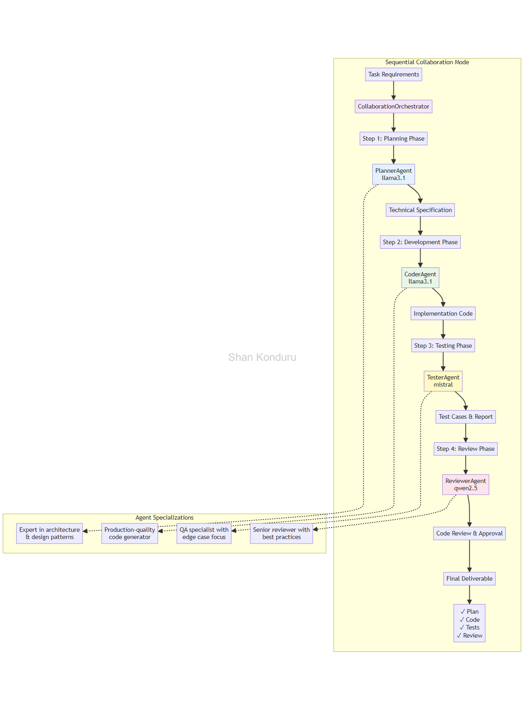

<details>
<summary>Mermaid Flowchart - Sequential Collaboration</summary>

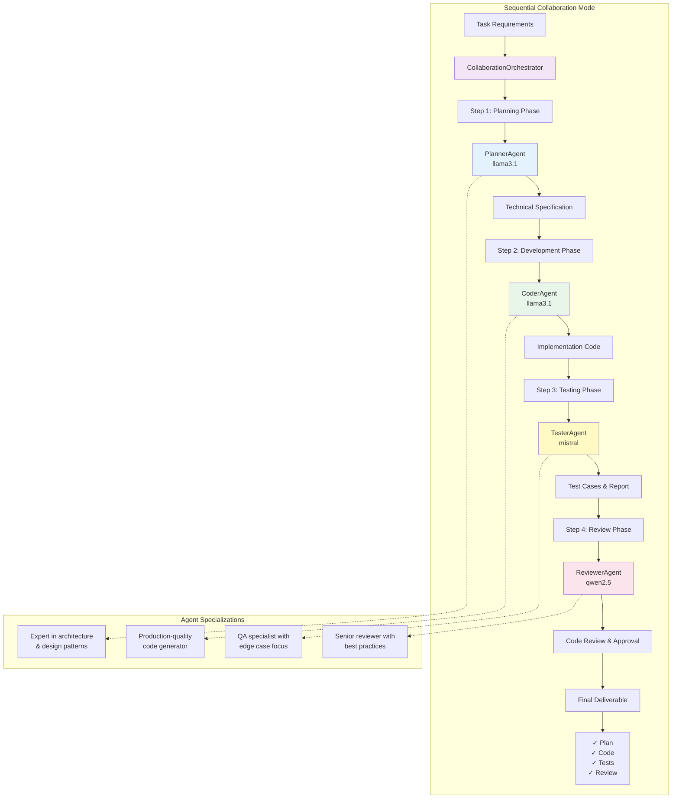

</details>

##### Parallel Collaboration Mode

The Parallel mode runs all agents simultaneously for comprehensive multi-perspective analysis.

<details>
<summary>Mermaid Flowchart - Parallel Collaboration</summary>

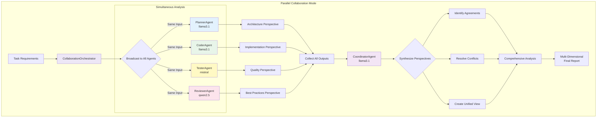

</details>

##### Hierarchical Collaboration Mode

The Hierarchical mode uses a coordinator to manage specialists and synthesize their work.

<details>
<summary>Mermaid Flowchart - Hierarchical Collaboration</summary>

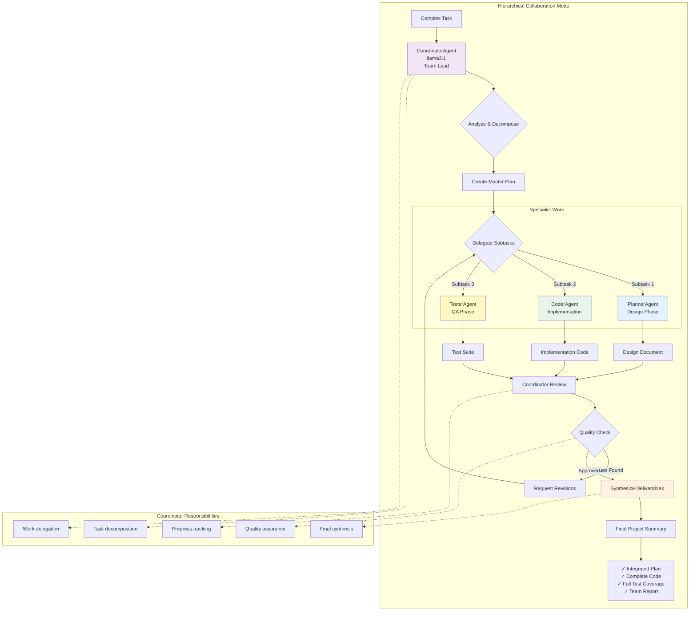

</details>

#### Multi-Agent Collaboration Examples

**Sequential Mode - Full Development Cycle**:
```bash
.\004_run.bat collaborate sequential

# Output demonstrates complete pipeline:
# 1. PlannerAgent: Creates technical specification for Fibonacci function
# 2. CoderAgent: Implements production-ready code with error handling
# 3. TesterAgent: Generates comprehensive test cases (happy path, edge cases, errors)
# 4. ReviewerAgent: Conducts code review with improvement suggestions
```

**Parallel Mode - Multi-Perspective Analysis**:
```bash
.\004_run.bat collaborate parallel

# Output shows simultaneous analysis:
# - PlannerAgent: Architectural recommendations
# - CoderAgent: Implementation strategies  
# - TesterAgent: Quality concerns and test approach
# - ReviewerAgent: Best practice considerations
# - Coordinator: Synthesized unified recommendation
```

**Hierarchical Mode - Coordinated Development**:
```bash
.\004_run.bat collaborate hierarchical

# Output demonstrates orchestrated workflow:
# 1. Coordinator: Creates master project plan
# 2. Specialists: Each completes assigned subtasks
# 3. Coordinator: Reviews and synthesizes all work
# 4. Final: Integrated deliverable with team summary
```

#### Agent Collaboration Summary

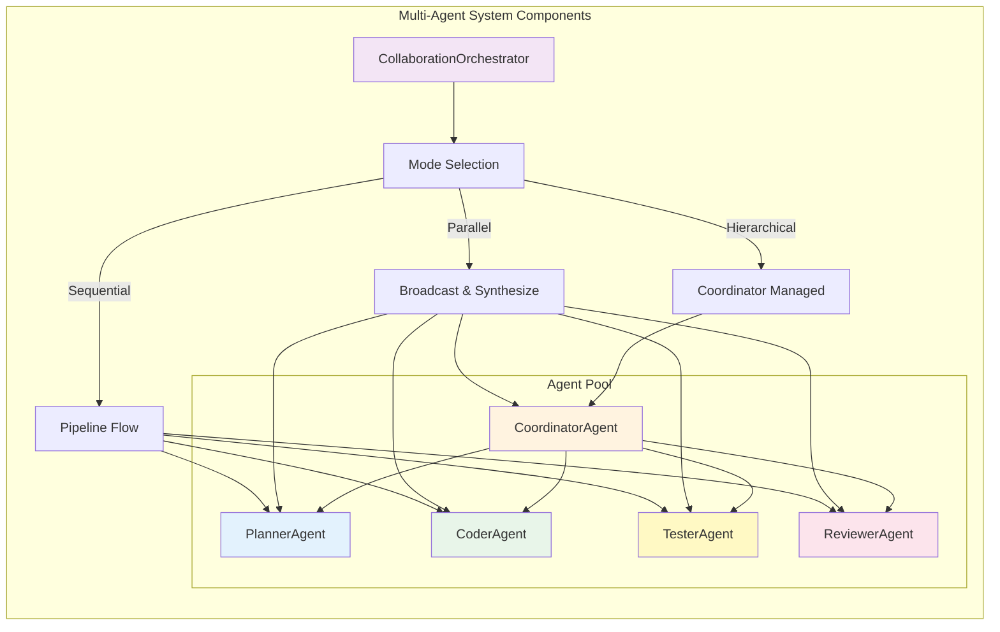

**Key Benefits**:
- ✅ **Specialized Expertise**: Each agent focuses on specific domain
- ✅ **Quality Assurance**: Built-in testing and code review
- ✅ **Flexible Workflows**: Three modes for different scenarios
- ✅ **Production Ready**: Comprehensive output with documentation
- ✅ **Scalable**: Easy to add new specialized agents

---

## Test Coverage & Quality

### Coverage Statistics

- **Overall Coverage**: 96% ✅
- **Total Tests**: 176 passing (100% success rate)
- **Test Framework**: pytest with comprehensive mocking
- **Test Execution Time**: ~20 seconds

### Module Coverage

| Module | Coverage | Tests |
|--------|----------|-------|
| `src/agents/config.py` | 100% | 5 tests |
| `src/agents/factual_judge.py` | 100% | 6 tests |
| `src/agents/collaboration_agent.py` | 98% | 8 tests |
| `src/agents/software_team.py` | 97% | 13 tests |
| `src/classic_metrics.py` | 100% | 22 tests |
| `src/tools.py` | 98% | 30 tests |
| `src/agents/chief_justice.py` | 98% | 4 tests |
| `src/agents/reflection_agent.py` | 96% | 18 tests |
| `src/llm_evaluation.py` | 96% | 8 tests |
| `src/agents/planning_agent.py` | 86% | 13 tests |
| `src/agents/tool_using_agent.py` | 93% | 14 tests |

### New Pattern Tests (Multi-Agent Collaboration)

- **21 new tests** added for Multi-Agent Collaboration Pattern
- **100% test success rate** for all collaboration modes
- Comprehensive coverage of:
  - Sequential, Parallel, and Hierarchical collaboration
  - All 5 specialized agents (Planner, Coder, Tester, Reviewer, Coordinator)
  - Agent task execution and error handling
  - Team creation and orchestration

For detailed coverage report, see [COVERAGE_96_PERCENT.md](COVERAGE_96_PERCENT.md).

---

## Classic NLP & RAG Metrics

### Evaluation Metrics & Design Patterns

This framework has evolved to incorporate sophisticated, agent-based evaluation patterns.

### Input Format

The script requires an input CSV file with the following columns:

*   `question`: The input question.
*   `answer`: The generated answer to be evaluated.
*   `contexts`: A string representation of a list of context documents used to generate the answer.
*   `ground_truth`: The correct or ideal answer.

**Sample Input: `evaluation_data.csv`**

```csv
question,answer,contexts,ground_truth
"What is the capital of France?","The capital of France is Paris.","['Paris is the capital and most populous city of France.']","The capital of France is indeed Paris."
"What is the main function of a cell's nucleus?","The nucleus controls the cell's growth and reproduction.","['The nucleus is a membrane-bound organelle that contains the cell''s genetic material.']","The nucleus directs all of the cell's activities, including growth and reproduction."
```

#### Judge Output

The script generates an output CSV file containing the detailed verdict from the judge for each case.

*   `case_index`: The row number from the input file.
*   `judge`: The name of the judge agent that ran the evaluation.
*   `score`: The final score assigned by the judge.
*   `verdict`: The detailed written explanation from the judge.
*   **(Optional)**: Additional columns for sub-metrics, such as `faithfulness` and `answer_correctness` from the `FactualJudgeAgent`.

**Sample Output: `factual_results.csv`**

```csv
case_index,judge,score,verdict,faithfulness,answer_correctness
0,FactualJudgeAgent,0.995,"The answer is factually consistent with the context and accurate against the ground truth...",1.0,0.99
1,FactualJudgeAgent,0.58,"The answer is partially correct, but not entirely faithful to the context...",0.5,0.66
```

**Sample Output: `jury_final_verdict.csv`**

```csv
case_index,final_verdict,final_score,factual_score,factual_verdict,clarity_score,clarity_verdict,relevance_score,relevance_verdict
0,"After a comprehensive review, the answer is deemed to be of high quality...",0.88,0.99,"The answer is factually sound.",0.85,"The answer is clear and concise.",0.9,"The answer is highly relevant."
```

### Execution and Capability Patterns

These patterns demonstrate what the agent can **do** by equipping it with tools and planning capabilities.

#### Tool Use Pattern (Function/API Calling)

This pattern equips an LLM agent with a predefined set of external tools and gives it the autonomy to decide **when** and **how** to use them to complete a task.

**Concept:** The agent analyzes the user's request, selects the most appropriate tool from its available toolkit, executes that tool with the correct parameters, and synthesizes a final answer based on the tool's results.

**Available Tools:**

1. **WebSearch** - Performs real web searches using DuckDuckGo API to find current information
2. **Calculator** - Evaluates mathematical expressions (arithmetic, trigonometry, complex calculations)
3. **DateTime** - Answers date and time questions (current date/time, day of week, date arithmetic)
4. **CodeInterpreter** - Executes simple Python code snippets safely

**Example Usage:**

```bash
# Mathematical calculation
.\004_run.bat tool-use "what is 156 times 89?"

# Date/time query
.\004_run.bat tool-use "what day of the week is Christmas 2025?"

# Web search
.\004_run.bat tool-use "what is ragas framework?"

# Complex calculation
.\004_run.bat tool-use "calculate the square root of 256"
```

**How It Works:**

1. **Analysis**: Agent receives the user's prompt
2. **Tool Selection**: LLM decides which tool is most appropriate (or if no tool is needed)
3. **Execution**: The selected tool is executed with appropriate parameters
4. **Synthesis**: Agent combines the tool's result with its reasoning to produce a final answer

**Sample Output:**

```
[ToolUsingAgent] Received prompt: 'what is 156 times 89?'
[ToolUsingAgent] Deciding which tool to use...
--- Executing CalculatorTool with expression: '156 * 89' ---

--- Final Answer ---
The result of 156 times 89 is 13,884.
```

#### Plan-and-Execute Pattern

This pattern decomposes a complex, open-ended goal into a sequence of smaller, manageable sub-tasks. The agent creates a plan, executes it step-by-step, and adjusts dynamically if needed.

**Concept:** The agent creates a multi-step plan where each step involves using a specific tool. It then executes the plan sequentially, tracking progress and synthesizing all results into a comprehensive final answer.

**Example Usage:**

```bash
# Multi-step goal requiring planning
.\004_run.bat plan-and-execute "Find out when Python was created and calculate what 2024 minus that year equals"

# Complex query with multiple tools
.\004_run.bat plan-and-execute "What is the square root of 144 and what day of the week is December 25, 2025?"
```

**How It Works:**

1. **Planning**: Agent decomposes the goal into a sequence of tool-using steps
2. **Execution**: Each step is executed in order using the specified tool
3. **Tracking**: Results from each step are collected
4. **Synthesis**: Final answer is generated by combining all step results

**Sample Output:**

```
[PlanningAgent] Received goal: 'What is 50 times 3 and what day is Christmas 2025?'
[PlanningAgent] Creating a plan...
[PlanningAgent] Plan created with 2 steps.

--- Executing Step 1/2: Calculate 50 times 3 ---
--- Executing CalculatorTool with expression: '50 * 3' ---

--- Executing Step 2/2: Find day of week for Christmas 2025 ---
--- Executing DateTimeTool with query: 'what day of the week is December 25, 2025?' ---

--- Final Answer ---
Based on the plan execution:
1. 50 times 3 equals 150
2. Christmas 2025 (December 25, 2025) falls on a Thursday
```

### Classic NLP & Retrieval Metrics

The classic commands still support the original set of metrics:
- **ROUGE, BLEU, BERTScore:** For generation quality.
- **Precision@K, Recall@K, MRR, nDCG:** For retrieval quality.

---

## Project Structure

```text
llm_design_patterns/
├── src/
│   ├── __init__.py
│   ├── agents/                    # All agent implementations
│   │   ├── __init__.py
│   │   ├── base.py               # BaseAgent abstract class
│   │   ├── config.py             # ConfigLoader for agent settings
│   │   ├── factual_judge.py     # Judge for factual accuracy
│   │   ├── clarity_judge.py     # Judge for clarity/style
│   │   ├── relevance_judge.py   # Judge for relevance
│   │   ├── safety_judge.py      # Judge for safety/ethics
│   │   ├── chief_justice.py     # Synthesizes jury verdicts
│   │   ├── tool_using_agent.py  # Tool Use pattern
│   │   ├── planning_agent.py    # Plan-and-Execute pattern
│   │   └── reflection_agent.py  # Reflection/Self-Correction pattern
│   ├── tools.py                  # External tools (Calculator, WebSearch, etc.)
│   ├── llm_evaluation.py         # RagasEvaluator and LLM factory
│   └── classic_metrics.py        # Classic NLP metrics (ROUGE, BLEU, etc.)
├── tests/
│   ├── __init__.py
│   ├── test_agents.py           # Tests for all judge agents
│   ├── test_planning_agent.py   # Tests for PlanningAgent
│   ├── test_tool_using_agent.py # Tests for ToolUsingAgent
│   ├── test_reflection_agent.py # Tests for ReflectionAgent
│   ├── test_tools.py            # Tests for external tools
│   ├── test_llm_evaluation.py   # Tests for evaluation logic
│   ├── test_classic_metrics.py  # Tests for classic metrics
│   └── test_main.py             # Tests for main application
├── images/                       # Diagrams and visualizations
├── htmlcov/                      # HTML coverage reports
├── docs/
│   ├── DESIGN_PATTERNS.md       # Complete pattern documentation
│   ├── COVERAGE_96_PERCENT.md   # Coverage achievement summary
│   └── REFLECTION_PATTERN_IMPLEMENTATION.md  # Reflection pattern details
├── agents.json                   # Agent configurations and personas
├── evaluation_data.csv           # Sample evaluation data
├── LLM_as_a_Judge.py            # Judge pattern CLI
├── LLM_as_a_Jury.py             # Jury pattern CLI
├── demo_reflection_pattern.py    # Reflection pattern demo
├── execution_patterns_runner.py  # Tool Use and Planning CLI
├── individual_metrics_runner.py  # Classic metrics CLI
├── requirements.txt              # Project dependencies
├── pytest.ini                    # Pytest configuration
├── README.md                     # This file
└── *.bat                         # Windows batch scripts for automation
```

---

## Technologies & Dependencies

### Core LLM & AI Libraries
- **langchain**: Framework for building LLM applications
- **langchain-ollama**: Integration for local LLM models via Ollama
- **ollama**: Python client for Ollama local LLM runner
- **ragas**: RAG pipeline evaluation framework
- **torch**: Deep learning framework for embeddings
- **datasets**: Data handling and structuring

### Evaluation & Metrics
- **rouge-score**: ROUGE metrics for text overlap
- **sacrebleu**: BLEU scores for translation quality
- **bert-score**: Semantic similarity using BERT embeddings
- **scikit-learn**: Classic ML metrics (MRR, nDCG)

### Development & Testing
- **pytest**: Testing framework
- **pytest-cov**: Code coverage measurement
- **pytest-html**: HTML test reports
- **ipython**: Interactive Python shell
- **dotenv**: Environment variable management

### Utilities
- **requests**: HTTP library for web searches
- **pandas**: Data manipulation and CSV handling
- **arize-phoenix**: LLM observability and tracing
- **nvidia-ml-py**: GPU monitoring

---

## LLM Models Used

This framework uses multiple LLM models via Ollama for different agent roles:

| Agent | Model | Purpose |
|-------|-------|---------|
| FactualJudgeAgent | llama3.1:latest | Factual accuracy evaluation |
| ClarityJudgeAgent | mistral:latest | Clarity and style assessment |
| RelevanceJudgeAgent | llama3:latest | Relevance evaluation |
| SafetyJudgeAgent | gemma3:latest | Safety and ethics checking |
| ChiefJusticeAgent | qwen2.5:latest | Verdict synthesis |
| ToolUsingAgent | llama3.1:latest | Dynamic tool selection |
| PlanningAgent | llama3.1:latest | Multi-step planning |
| ReflectionAgent | llama3.1:latest | Iterative refinement |

**Embedding Model**: `nomic-embed-text:latest` (for RAG evaluation)

---

---

## Batch Scripts (Windows)

This project includes comprehensive batch files for Windows workflow automation:

### Setup Scripts
- **`000_init.bat`**: Initialize Git repository and configure user settings
- **`001_env.bat`**: Create Python virtual environment (`.venv`)
- **`002_activate.bat`**: Activate the virtual environment
- **`003_setup.bat`**: Install dependencies from `requirements.txt`

### Execution Scripts
- **`004_run.bat`**: Unified entry point for all evaluation tasks (see Usage section)
- **`005_run_test.bat`**: Run unit tests with pytest
- **`005_run_code_cov.bat`**: Run tests with code coverage reporting
- **`008_deactivate.bat`**: Deactivate the virtual environment

---

## Pattern Composition

These patterns can be combined for sophisticated multi-agent systems:

### Recommended Combinations

**Planning + Reflection**
```bash
# Create a plan, then refine each step through reflection
# Use case: High-quality multi-step content generation
```

**Tool Use + Reflection**
```bash
# Use tools to gather data, then refine the answer
# Use case: Research-backed content with quality assurance
```

**Planning + Tool Use**
```bash
# Already implemented! Plan-and-Execute pattern uses tools
# Use case: Complex queries requiring multiple data sources
```

**Jury + Reflection**
```bash
# Generate with reflection, evaluate with jury
# Use case: Maximum quality assurance for critical content
```

---

## Quick Start Guide

### 1. Setup Environment

```bash
# Initialize and setup (run once)
.\000_init.bat      # Initialize Git
.\001_env.bat       # Create virtual environment
.\002_activate.bat  # Activate environment
.\003_setup.bat     # Install dependencies
```

### 2. Install Ollama & Models

Download Ollama from [ollama.ai](https://ollama.ai) and install required models:

```bash
ollama pull llama3.1:latest
ollama pull mistral:latest
ollama pull llama3:latest
ollama pull gemma3:latest
ollama pull qwen2.5:latest
ollama pull nomic-embed-text:latest
```

### 3. Run Pattern Examples

```bash
# Tool Use Pattern
.\004_run.bat tool-use "what is 156 times 89?"

# Plan-and-Execute Pattern
.\004_run.bat plan-and-execute "Calculate 50*3 and find what day is Christmas 2025"

# Reflection Pattern
.\004_run.bat reflection "Write a factorial function in Python"

# Judge Pattern
.\004_run.bat judge --input evaluation_data.csv --output results.csv --judge factual

# Jury Pattern
.\004_run.bat jury --input evaluation_data.csv --output final_verdict.csv
```

### 4. Run Tests

```bash
# Run all tests
.\005_run_test.bat

# Run with coverage report
.\005_run_code_cov.bat

# Run specific pattern tests
pytest tests/test_reflection_agent.py -v
pytest tests/test_planning_agent.py -v
pytest tests/test_tool_using_agent.py -v
```

---

## Documentation

### Complete Documentation Files

- **[DESIGN_PATTERNS.md](DESIGN_PATTERNS.md)**: Comprehensive guide to all 5 design patterns
- **[COVERAGE_96_PERCENT.md](COVERAGE_96_PERCENT.md)**: Test coverage achievement summary
- **[REFLECTION_PATTERN_IMPLEMENTATION.md](REFLECTION_PATTERN_IMPLEMENTATION.md)**: Detailed Reflection pattern implementation
- **[TEST_COVERAGE_SUMMARY.md](TEST_COVERAGE_SUMMARY.md)**: Complete test suite breakdown

### Code Examples

- **`demo_reflection_pattern.py`**: Reflection pattern demonstrations with 4 use cases
- **`execution_patterns_runner.py`**: Tool Use and Plan-and-Execute examples
- **`LLM_as_a_Judge.py`**: Single judge evaluation examples
- **`LLM_as_a_Jury.py`**: Multi-agent jury evaluation examples

---

## Performance Considerations

### Resource Usage

| Pattern | LLM Calls | Latency | Cost |
|---------|-----------|---------|------|
| Judge | 1-2 | Low | $ |
| Jury | 4-6 | Medium-High | $$$ |
| Tool Use | 1-2 | Low-Medium | $ |
| Plan-and-Execute | 2-N | Medium | $$ |
| Reflection | 3-5x | High | $$$ |

### Optimization Tips

1. **Use quality thresholds wisely**: Set appropriate thresholds to avoid unnecessary iterations
2. **Cache tool results**: Implement caching for repeated tool calls
3. **Parallel execution**: Run independent judge evaluations in parallel (Jury pattern)
4. **Model selection**: Use smaller models for simple tasks, larger for complex reasoning
5. **Batch processing**: Process multiple evaluations together when possible

---

## Contributing

Contributions are welcome! Areas for contribution:

- **New Design Patterns**: Implement additional LLM design patterns
- **Additional Tools**: Extend the tool library with new capabilities
- **Performance Optimization**: Improve execution speed and resource usage
- **Documentation**: Enhance examples and tutorials
- **Test Coverage**: Add tests for edge cases

Please submit pull requests or open issues for discussion.

---

## License

This project is licensed under the MIT License.
