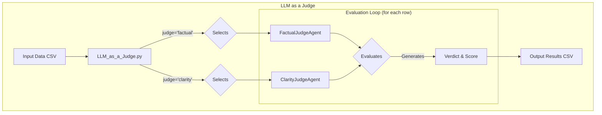
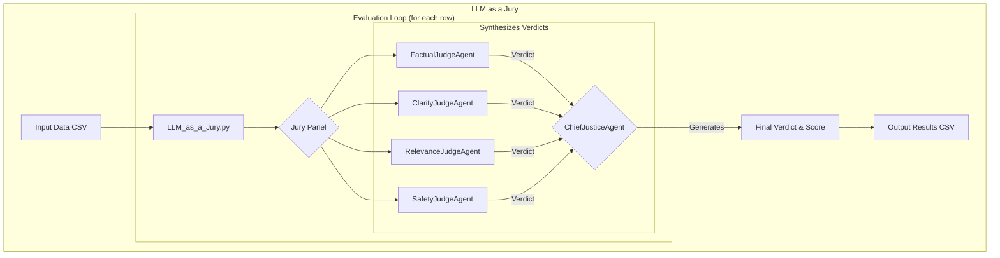

# RAG Evaluation Framework using Ragas

## Description

This project provides a robust framework for evaluating the performance of Retrieval-Augmented Generation (RAG) pipelines. It utilizes the `ragas` library to assess various aspects of a RAG system's output, such as faithfulness, answer relevancy, context precision, and recall.

The framework is designed to be easily extensible and allows for testing different evaluation metrics against predefined positive and negative scenarios. This helps in systematically analyzing the strengths and weaknesses of your RAG implementation.

## Installation

Follow these steps to set up the project environment on Windows.

1. **Initialize Git:**
   Run the `000_init.bat` script to initialize the Git repository and configure user settings.

   ```bash
   .\000_init.bat
   ```

2. **Create Virtual Environment:**
   Run `001_env.bat` to create a Python virtual environment named `.venv`.

   ```bash
   .\001_env.bat
   ```

3. **Activate Virtual Environment:**
   Activate the environment by running `002_activate.bat`.

   ```bash
   .\002_activate.bat
   ```

4. **Install Dependencies:**
   Run `003_setup.bat` to install all the required packages from `requirements.txt`.

   ```bash
   .\003_setup.bat
   ```

## Usage

The `004_run.bat` script is the unified entry point for all evaluation tasks. It accepts a command as its first argument to determine which evaluation to run.

### Running Evaluations

1.  **Display Help:**
    Run the script without any arguments to see a detailed list of all available commands and their specific options.

    ```bash
    .\004_run.bat
    ```

2.  **Classic Metric Commands**
    These commands run the original evaluation script (`individual_metrics_runner.py`) for classic NLP and Ragas metrics.

    *   **Usage:** `.\004_run.bat <metric_name>`
    *   **Example:** To run the `faithfulness` metric:
        ```bash
        .\004_run.bat faithfulness
        ```
    *   **Available Commands:** `faithfulness`, `answer_relevancy`, `context_recall`, `context_precision`, `answer_correctness`, `classic`, `retrieval`, `all`.

3.  **Agentic Command: `judge`**
    This command runs an evaluation on a dataset using a single, specialized judge agent.

    *   **Usage:** `.\004_run.bat judge --input <infile> --output <outfile> --judge <judge_name>`
    *   **Example:** To evaluate a dataset for clarity:
        ```bash
        .\004_run.bat judge --input data/eval_data.csv --output results/judge_clarity_results.csv --judge clarity
        ```
    *   **Available Judges:** `factual`, `clarity`, `relevance`, `safety`.

4.  **Agentic Command: `jury`**
    This command runs the full, multi-agent system for a comprehensive evaluation.

    *   **Usage:** `.\004_run.bat jury --input <infile> --output <outfile>`
    *   **Example:**
        ```bash
        .\004_run.bat jury --input data/eval_data.csv --output results/jury_final_verdict.csv
        ```

## Evaluation Metrics & Design Patterns

This framework has evolved to incorporate sophisticated, agent-based evaluation patterns.

### LLM as a Judge

This design pattern uses a single, specialized LLM agent to evaluate one specific quality dimension of a system's output. Each "Judge" has a unique persona and a focused task, allowing for a targeted, in-depth analysis of a single aspect.

For example, the `FactualJudgeAgent` is prompted to focus solely on factual consistency and accuracy, while the `ClarityJudgeAgent` assesses how clear and easy to understand an answer is. This provides a qualitative score and a written verdict for a specific evaluation criterion.

#### Flowchart


<details>
<summary>Mermaid Diagram Code</summary>



</details>

#### Input

The script requires an input CSV file containing the data to be evaluated. The necessary columns depend on the judge being used. For the `FactualJudgeAgent`, the following columns are required:

*   `question`: The input question.
*   `answer`: The generated answer to be evaluated.
*   `contexts`: A string representation of a list of context documents used to generate the answer.
*   `ground_truth`: The correct or ideal answer.

**Sample Input: `evaluation_data.csv`**

```csv
question,answer,contexts,ground_truth
"What is the capital of France?","The capital of France is Paris.","['Paris is the capital and most populous city of France.']","The capital of France is indeed Paris."
"What is the main function of a cell's nucleus?","The nucleus controls the cell's growth and reproduction.","['The nucleus is a membrane-bound organelle that contains the cell''s genetic material.']","The nucleus directs all of the cell's activities, including growth and reproduction."
```

#### Judge Output

The script generates an output CSV file containing the detailed verdict from the judge for each case.

*   `case_index`: The row number from the input file.
*   `judge`: The name of the judge agent that ran the evaluation.
*   `score`: The final score assigned by the judge.
*   `verdict`: The detailed written explanation from the judge.
*   **(Optional)**: Additional columns for sub-metrics, such as `faithfulness` and `answer_correctness` from the `FactualJudgeAgent`.

**Sample Output: `factual_results.csv`**

```csv
case_index,judge,score,verdict,faithfulness,answer_correctness
0,FactualJudgeAgent,0.995,"The answer is factually consistent with the context and accurate against the ground truth...",1.0,0.99
1,FactualJudgeAgent,0.58,"The answer is partially correct, but not entirely faithful to the context...",0.5,0.66
```

### LLM as a Jury

This is a more advanced pattern that orchestrates a panel of specialized "Judge" agents. A "Chief Justice" agent manages the process.

1.  **The Jury Panel**: Multiple agents (`FactualJudgeAgent`, `ClarityJudgeAgent`, `RelevanceJudgeAgent`, etc.) each evaluate the same case from their unique perspective.
2.  **The Chief Justice**: This final agent collects the verdicts and scores from all judges. It then synthesizes this information into a single, comprehensive final judgment and an overall score.

This pattern provides a holistic, multi-faceted evaluation that balances different quality dimensions, mimicking a real-world panel of experts.

#### Jury Flowchart


<details>
<summary>Mermaid Diagram Code</summary>



</details>

#### Jury Input

The input format is the same as for the "LLM as a Judge" pattern.

**Sample Input: `evaluation_data.csv`**

```csv
question,answer,contexts,ground_truth
"What is the capital of France?","The capital of France is Paris.","['Paris is the capital and most populous city of France.']","The capital of France is indeed Paris."
```

#### Jury Output

The script generates a single CSV file containing the comprehensive final verdict from the Chief Justice, along with all the intermediate verdicts from the individual judges.

*   `case_index`: The row number from the input file.
*   `final_verdict`: The comprehensive summary from the Chief Justice.
*   `final_score`: The final, synthesized score.
*   `[judge_name]_score`: The score from each individual judge.
*   `[judge_name]_verdict`: The written verdict from each individual judge.

**Sample Output: `jury_final_verdict.csv`**

```csv
case_index,final_verdict,final_score,factual_score,factual_verdict,clarity_score,clarity_verdict,relevance_score,relevance_verdict
0,"After a comprehensive review, the answer is deemed to be of high quality...",0.88,0.99,"The answer is factually sound.","0.85","The answer is clear and concise.","0.9","The answer is highly relevant."
```

### Classic NLP & Retrieval Metrics

The classic commands still support the original set of metrics:
- **ROUGE, BLEU, BERTScore:** For generation quality.
- **Precision@K, Recall@K, MRR, nDCG:** For retrieval quality.

## Project Structure


```text
.
├── src/
│   ├── __init__.py
│   ├── llm_evaluation.py   # Contains the RagasEvaluator class and LLM factory.
│   └── classic_metrics.py  # Contains the ClassicMetricEvaluator for ROUGE, BLEU, etc.
├── tests/
│   ├── __init__.py
│   ├── test_llm_evaluation.py # Unit tests for the evaluation logic.
│   └── test_main.py        # Unit tests for the main application script.
├── .env                    # Environment variables (e.g., API keys).
├── main.py                 # Main script to run evaluations.
├── requirements.txt        # Project dependencies.
├── pytest.ini              # Pytest configuration.
├── README.md               # This file.
└── *.bat                   # Batch scripts for Windows automation.
```

## Batch Scripts (Windows)

This project includes the following batch files to simplify common tasks on Windows:

- `000_init.bat`: Initializes the Git repository and sets up local user config.
- `001_env.bat`: Creates a Python virtual environment named `.venv`.
- `002_activate.bat`: Activates the `.venv` virtual environment.
- `003_setup.bat`: Installs Python packages from `requirements.txt`.
- `004_run.bat`: Executes the main script (`main.py`) to run all evaluations.
- `005_run_test.bat`: Runs unit tests using `pytest`.
- `005_run_code_cov.bat`: Runs unit tests with code coverage reporting.
- `008_deactivate.bat`: Deactivates the virtual environment.

## Contributing

Contributions are welcome! Please feel free to submit a pull request or open an issue to discuss potential changes.

## License

This project is licensed under the MIT License.

This project is licensed under the MIT License.
